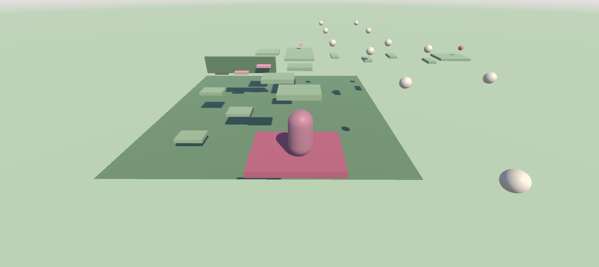

# TP1 - Erika Anahí Quispe

## Descripción

Proyecto individual realizado en Unity 6 LTS para la materia Programación de Videojuegos I.

El proyecto consiste en un escenario 3D interactivo en el que el jugador debe recorrer un pequeño circuito de plataformas y obstáculos, recoger un objeto y transportarlo hasta la zona de meta.

Durante el recorrido se encuentran plataformas móviles, obstáculos generados automáticamente y un PowerUp temporal que modifica la velocidad del jugador.

## Versión de Unity

* Unity 6 LTS

## Controles

* **W, A, S, D:** Mover al jugador.
* **Espacio:** Saltar.
* **E:** Agarrar y soltar el objeto transportable.
* **Botón derecho del mouse:** Controlar la cámara.

## Mecánicas implementadas

### Movimiento del jugador

El jugador puede desplazarse por el escenario y saltar utilizando un Rigidbody y un sistema de movimiento mediante teclado.

La cámara sigue al jugador y permite controlar su orientación manteniendo presionado el botón derecho del mouse.

### Plataformas móviles

El escenario contiene tres escalones móviles que se extienden y retraen de manera secuencial.

El cambio de estado de los escalones se controla mediante `Invoke()` y su movimiento se realiza de forma progresiva utilizando `Vector3.MoveTowards()` y `Time.deltaTime`.

### Obstáculos generados automáticamente

Se incorporaron proyectiles como obstáculos.

Los proyectiles se generan mediante un Spawner que utiliza `InvokeRepeating()` para crearlos periódicamente.

Cada proyectil se destruye después de un determinado tiempo para evitar que se acumulen objetos innecesariamente en la escena.

### Objeto transportable

El jugador debe acercarse al objeto y presionar **E** para recogerlo.

Al recogerlo, el objeto se vincula al punto de transporte del jugador mediante `SetParent()` y se modifica su estado físico para poder transportarlo.

Al presionar nuevamente **E**, el objeto se suelta y recupera su comportamiento físico.

### PowerUp

El escenario contiene un PowerUp que aumenta temporalmente la velocidad del jugador.

El efecto se activa al entrar en contacto con el PowerUp y utiliza una **corrutina** para controlar la duración del efecto.

Al finalizar el tiempo establecido, la velocidad del jugador vuelve a su valor original y el PowerUp vuelve a estar disponible.

### Zona de meta y victoria

La zona de meta utiliza un `Collider` configurado como Trigger.

Al ingresar a la zona, se comprueba que el jugador esté transportando el objeto correspondiente antes de activar el mensaje de victoria.

Si el objeto no fue llevado hasta la meta, el juego indica mediante la consola que es necesario transportarlo.

## Captura del juego

## Uso de herramientas de IA

Durante el desarrollo del proyecto utilicé ChatGPT como herramienta de apoyo para comprender conceptos de C# y Unity, especialmente en las partes de programación, ya que es uno de los aspectos que más me cuesta.

La interfaz de Unity y la construcción del escenario fueron realizadas de manera intuitiva, y disfruté especialmente la parte de diseño y armado del recorrido.

El código utilizado fue revisado, adaptado y probado dentro de Unity para comprender su funcionamiento y no simplemente utilizado como un copia y pega.
